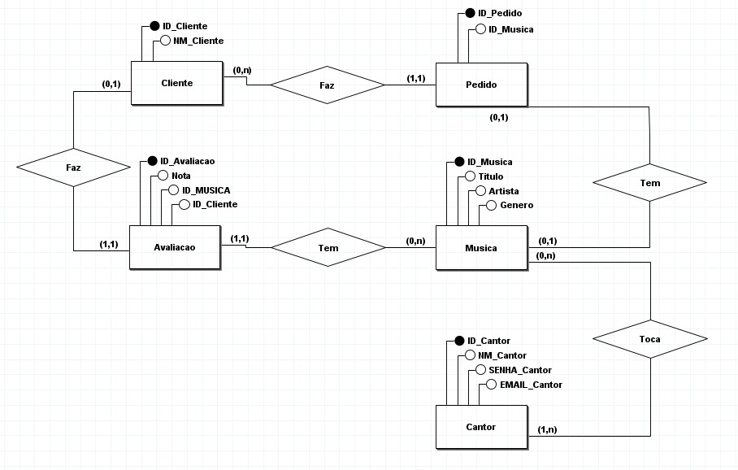
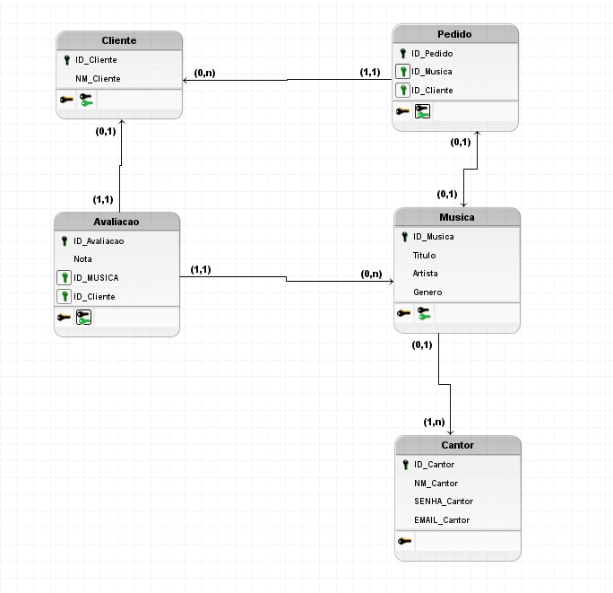

# 🎶 M8MUSIC

> Aplicação desenvolvida em **Java** com **Spring** e **OracleSQL**, focada no gerenciamento de eventos e automação de
> processos administrativos.  
> Este projeto integra recursos de documentação via **Swagger** e segue princípios de desenvolvimento em camadas.

---

## 👥 **Integrantes do Grupo**

| Nome Completo | Função / Responsabilidade |
---
| **Henrique Batista de Souza - RM99742** | Líder do Projeto / Desenvolvedor Full-Stack (Java & ASP.NET / React.js &
React-Native & Typescript) |

| **Julia Lima Rodrigues - RM559781** | Desenvolvedora Back-end (Java & ASP.NET) / DevOps (Microsoft Azure) / QA &
Insurance |

| **Felipe Soares Gonçalves - RM559175** | Desenvolvedor Front-End (React.js) / Desenvolvedor Mobile (React-Native) /
Desenvolvedor IOT (Arduino) / Banco de Dados (OracleSQL) |

---

## 🗓️ **Cronograma de Desenvolvimento**

| Etapa | Atividade                                            | Responsável                        | Prazo      | Status      |
|-------|------------------------------------------------------|------------------------------------|------------|-------------|
| 1     | Coordenação de atividades                            | Julia                              | 09/11/2025 | ✅ Concluído |
| 2     | Correção e aplicação do banco de dados para API Java | Felipe                             | 09/11/2025 | ✅ Concluído |
| 3     | Documentação da API e testes                         | Julia                              | 09/11/2025 | ✅ Concluído |
| 4     | Integração com o banco de dados OracleSQL            | Henrique                           | 09/11/2025 | ✅ Concluído |
| 5     | Adequação e http response para controllers           | Henrique                           | 09/11/2025 | ✅ Concluído |
| 6     | Gravação e entrega Sprint 2                          | Henrique (Somente o líder entrega) | 09/11/2025 | ✅ Concluído |

---

## ⚙️ **Como Rodar a Aplicação**

### ✅ Pré-requisitos

- **Java 17+**
- **Spring Boot**
- **OracleSQL**
- **Maven 3.8+**

### 🚀 Passos para execução

1. **Clonar o repositório:**
   ```bash
   git clone https://github.com/CyPHER298/m8muisc-api.git
   ```

2. **Acessar o diretório do projeto:**
   ```bash
   cd m8music-api
   ```

3. **Configurar o banco de dados no arquivo `application.properties`:**
   ```properties
   spring.datasource.url=jdbc:oracle:thin:@oracle.fiap.com.br:1521:xe
   spring.datasource.username=rm99742
   spring.datasource.password=290305
   spring.jpa.hibernate.ddl-auto=update
   spring.jpa.show-sql=true
   ```

4. **Executar o projeto:**
   ```bash
   mvn clean install
   mvn spring-boot:run

   ```

5. **Acessar a documentação Swagger:**
   ```
   http://localhost:8080/swagger-ui.html
   ```

---

## 🧩 **Diagramas da Aplicação**

### 🗃️ Diagrama de Classes

**MER**


**DER**


---

## 🎥 **Vídeo de Apresentação**

📺 [Assista à apresentação no YouTube](https://youtu.be/8oGh5lXjscI)

O vídeo apresenta:

- A **proposta tecnológica** e objetivo da aplicação;
- O **público-alvo** (organizadores e participantes de eventos);
- Os **problemas solucionados**, como automação e controle de processos.

---

## 🔗 **Documentação da API (Swagger / OpenAPI)**

### **Principais Endpoints**

| Método     | Endpoint             | Descrição                       |
|------------|----------------------|---------------------------------|
| **GET**    | `/api/clientes`      | Lista todos os clientes         |
| **GET**    | `/api/clientes/{id}` | Retorna um clientes pelo **id** |
| **POST**   | `/api/clientes`      | Cadastra um novo cliente        |
| **PUT**    | `/api/clientes/{id}` | Atualiza um cliente             |
| **DELETE** | `/api/clientes/{id}` | Remove um cliente existente     |
| **GET**    | `/api/cantores`      | Lista todos os cantores         |
| **GET**    | `/api/cantores/{id}` | Retorna um cantor pelo **id**   |
| **POST**   | `/api/cantores`      | Cadastra um novo cantor         |
| **PUT**    | `/api/cantores/{id}` | Atualiza um cantor existente    |
| **DELETE** | `/api/cantores/{id}` | Remove um cantor existente      |
| **GET**    | `/api/musica`        | Lista todos os participantes    |
| **GET**    | `/api/musica/{id}`   | Retorna uma música pelo **id**  |
| **POST**   | `/api/musica`        | Cadastra uma nova música        |
| **PUT**    | `/api/musica/{id}`   | Atualiza uma música existente   |
| **DELETE** | `/api/musica/{id}`   | Remove uma música existente     |
| **GET**    | `/api/pedido`        | Lista todos os pedidos          |
| **GET**    | `/api/pedido/{id}`   | Retorna um pedido pelo **id**   |
| **POST**   | `/api/pedido`        | Cadastra um novo pedido         |
| **PUT**    | `/api/pedido/{id}`   | Atualiza uma pedido existente   |
| **DELETE** | `/api/pedido/{id}`   | Remove um pedido existente      |

---

## 🧾 **Tecnologias Utilizadas**

- **Java 17**
- **Spring Boot**
- **OracleSQL**
- **Swagger**

---

## 📜 **Observação**

Este projeto foi desenvolvido para fins acadêmicos na disciplina de **Desenvolvimento Web — Sprint 1 (Java)**.

---

## 📈 **Avanço**

Desde a primeira sprint a aplicação teve adequação de rotas com HATEOAS e resposta HTTP para endpoints.
Conexão com banco de dados ORACLE foi mantida corretamente. 

*Segue o script para criação das tabelas caso não esteja
sendo possível realizar as trocas de informações:*

```
DROP TABLE avaliacao CASCADE CONSTRAINTS;
DROP TABLE pedido CASCADE CONSTRAINTS;
DROP TABLE musica CASCADE CONSTRAINTS;
DROP TABLE cantor CASCADE CONSTRAINTS;
DROP TABLE cliente CASCADE CONSTRAINTS;

CREATE TABLE cliente (
  id_cliente NUMBER(2) GENERATED ALWAYS AS IDENTITY PRIMARY KEY,
  nm_cliente VARCHAR2(50) NOT NULL
);

CREATE TABLE cantor (
  id_cantor NUMBER(2) GENERATED ALWAYS AS IDENTITY PRIMARY KEY,
  nm_cantor VARCHAR2(50) NOT NULL,
  senha_cantor VARCHAR2(10),
  email_cantor VARCHAR2(50) UNIQUE
);

CREATE TABLE musica (
  id_musica NUMBER(2) GENERATED ALWAYS AS IDENTITY PRIMARY KEY,
  titulo VARCHAR2(50) NOT NULL,
  artista VARCHAR2(50),
  genero VARCHAR2(50)
);

CREATE TABLE pedido (
  id_pedido NUMBER(2) GENERATED ALWAYS AS IDENTITY PRIMARY KEY,
  id_cliente NUMBER(2) NOT NULL,
  id_musica NUMBER(2) NOT NULL,
  FOREIGN KEY (id_cliente) REFERENCES cliente(id_cliente),
  FOREIGN KEY (id_musica) REFERENCES musica(id_musica)
);

CREATE TABLE avaliacao (
  id_avaliacao NUMBER(2) GENERATED ALWAYS AS IDENTITY PRIMARY KEY,
  nota NUMBER CONSTRAINT chk_nota CHECK (nota BETWEEN 1 AND 5),
  id_musica NUMBER(2) NOT NULL,
  id_cliente NUMBER(2) NOT NULL,
  FOREIGN KEY (id_musica) REFERENCES musica(id_musica),
  FOREIGN KEY (id_cliente) REFERENCES cliente(id_cliente)
);
```